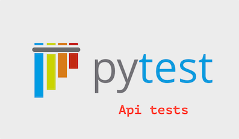

[](https://github.com/berpress/python-api-tests/actions/workflows/tests.yml)
# Python api tests


This is a tutorial project that shows how to implement api tests in Python

The project uses:
1. Python
2. Requests
3. Allure for reports
4. CI (GitHub actions)


Testing application (write with Flask):

git: https://github.com/berpress/flask-restful-api

url: https://stores-tests-api.herokuapp.com

swagger: https://app.swaggerhub.com/apis/berpress/flask-rest-api/1.0.0


### How to start

Use python 3.8 +
Create and activate virtual environments

```
python3 -m venv env
source env/bin/activate
```

Run in terminal

```
pip install -r requirements.txt
```

or install poetry https://python-poetry.org/, then

```
poetry install
```

and add pre-commit
```
pre-commit install
```

### Run all tests

```python
pytest
```

Some requests require an authorization token. Use header like
```angular2html
"Authorization": "JWT {token}"
```

### Run all tests
```
Download the yes common/report to view the API test coverage report
```
